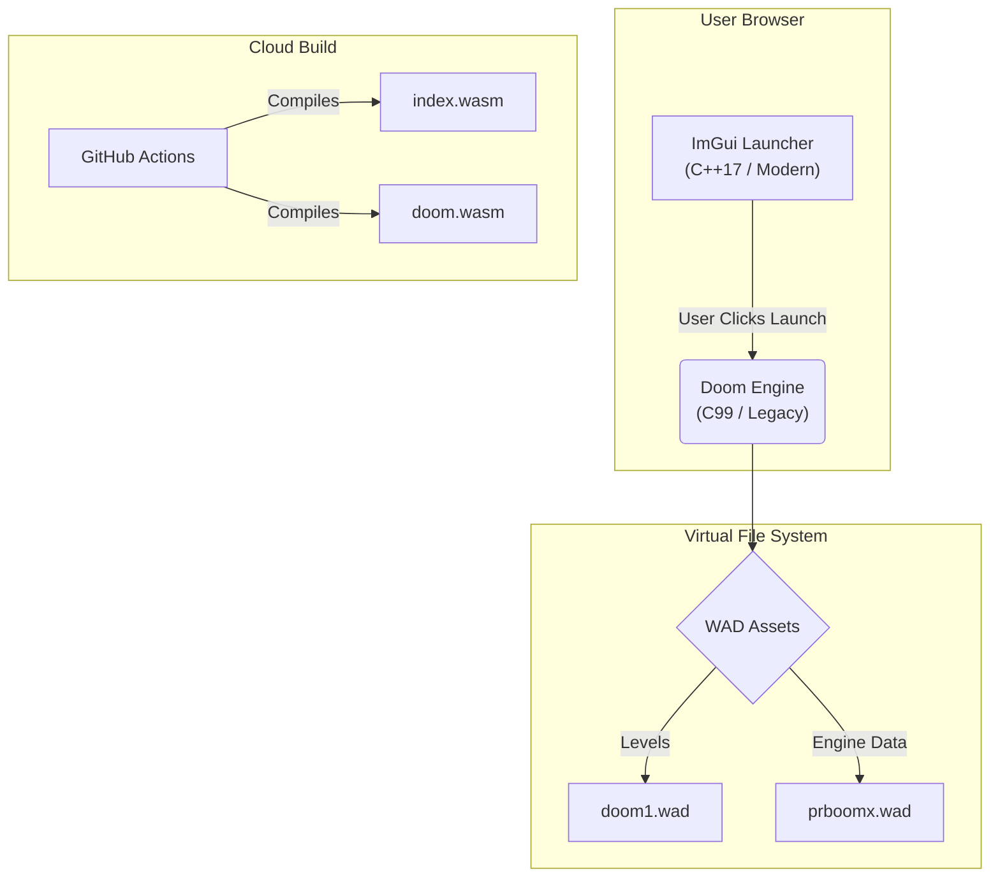

# Browser-Based Runtime Emulator (C++ / WASM)


A high-performance systems demonstration pushing the limits of **WebAssembly**. This project orchestrates a **C++17 ImGui Interface** that initializes and controls a sandboxed instance of the **Doom Engine (PrBoom+)**, running entirely client-side with no external plugins.

### ⚡ Engineering Significance
This repository serves as a case study in **Legacy Modernization** and **Systems-Level Web Development**. It proves the ability to:
1.  **Port Native Logic:** Encapsulate complex C/C++ desktop applications for the web.
2.  **Manage Virtualized I/O:** Implement a Virtual File System (VFS) to handle asset streaming in a browser environment.
3.  **Sandboxed Execution:** Run unsafe legacy pointer logic within a secure WASM memory container.

### 🔗 [Live System Demo](https://emscripten-portfolio-m359.vercel.app/)

---

## 🏗 Architecture

This is not a standard website; it is a **multi-process simulation** running under a single domain.

1.  **The Host (Control Plane):** A modern C++17 application using **Dear ImGui**. It manages the event loop, state persistence, and context switching.
2.  **The Guest (Compute Plane):** A compiled WebAssembly port of **PrBoom+**. It handles the raw computation, sound synthesis, and software rendering, outputting to a shared canvas buffer.



## 🚀 Technical Features

* **Dual-Wasm Architecture:** Demonstrates linking and routing between multiple WebAssembly binaries (`index.wasm` for UI, `doom.wasm` for Gameplay).
* **Virtual File System (VFS):** Implements an in-memory file system to serve WAD assets to the legacy engine, simulating disk I/O in the browser.
* **Persistent State:** Save/Load functionality managed via LocalStorage synchronization.
* **Graphics Pipeline:** A responsive, windowless desktop interface rendered via OpenGL ES 3.0.
* **Automated CI/CD:** A robust pipeline that compiles the Game Engine, bundles assets, compiles the Launcher, and deploys to Vercel Edge Network.

## 🛠 Local Development

Building this project requires compiling two different engines and managing game assets. We use a unified build script to handle this orchestration.

### Prerequisites
* **Emscripten SDK** (Latest stable)
* **CMake** (3.10+)
* **Git**
* **Python 3** (For local serving)

### Quick Start

1.  **Clone the Repository**
    ```bash
    git clone --recursive [https://github.com/gammahazard/Emscripten-portfolio.git](https://github.com/gammahazard/Emscripten-portfolio.git)
    cd Emscripten-portfolio
    ```

2.  **Add Game Assets**
    * **Doom Shareware:** The build script downloads this automatically.
    * **Engine Data (`prboomx.wad`):** You must place the valid `prboomx.wad` (approx 460KB) in the project root.
    * *(Note: This file is required for menus and fonts to render correctly).*

3.  **Run the Build Script**
    We use a custom script to handle dependency fetching (ImGui, Dwasm) and Wasm compilation.
    ```bash
    # Uses the production script (same as CI)
    chmod +x scripts/build_prod.sh
    ./scripts/build_prod.sh
    ```

4.  **Serve Locally**
    Navigate to the distribution folder and start a server.
    ```bash
    cd dist
    python3 -m http.server 8080
    ```
    Open `http://localhost:8080` in your browser.

## ⚙️ DevOps & Deployment

The project is deployed to **Vercel**, utilizing `vercel.json` to handle the complex routing required for the game engine.

* **Routing:**
    * `/` -> Serves the ImGui Launcher.
    * `/doom` -> Serves the Game Engine.
* **Security Headers:** Configured with `Cross-Origin-Opener-Policy` and `Cross-Origin-Embedder-Policy` to allow high-performance memory access (SharedArrayBuffer).

### The Pipeline (`.github/workflows/main.yml`)
The workflow executes `scripts/build_prod.sh` in a clean container environment. It handles:
1.  Cloning the Doom Engine (Dwasm).
2.  Injecting the `prboomx.wad` from the repo.
3.  Compiling the Game to `dist/doom/`.
4.  Compiling the Launcher to `dist/`.
5.  Deploying the static artifacts.

## 📄 License

* **Launcher Code:** MIT License.
* **Doom Engine (Dwasm/PrBoom+):** GPL v2.0 (Derivative work of the Doom Engine).
* **Game Assets:** Shareware Doom is freely distributable.
