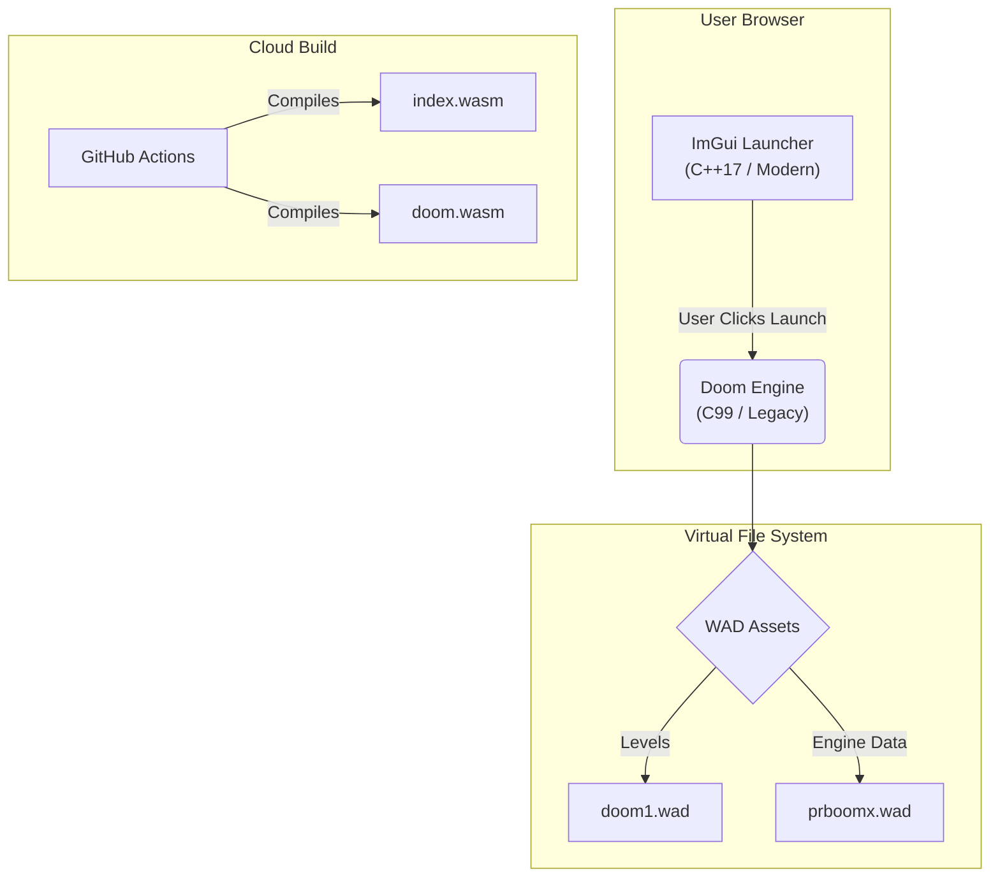

# C++ WebAssembly Doom Launcher


A high-performance, serverless web application that pushes the limits of **WebAssembly**. This project features a **C++17 ImGui Launcher** that seamlessly boots a full port of the **Doom Engine (PrBoom+)** directly in the browser, with no external plugins.

It demonstrates a complex "Micro-Frontend" architecture where two distinct C/C++ codebases (Modern C++ Portfolio and Legacy C Game Engine) are compiled into separate Wasm modules and deployed via a unified CI/CD pipeline.

### 🔗 [Live Demo](https://emscripten-portfolio-m359.vercel.app/)

---

## 🏗 Architecture

This is not just a website; it is two compiled applications living under one domain.

1.  **The Launcher (Host):** A lightweight C++17 application using **Dear ImGui**. It handles the UI, theme switching, and persistence.
2.  **The Engine (Guest):** A WebAssembly port of **PrBoom+ (Dwasm)**. It runs the actual game logic, sound synthesis, and software rendering.



## 🚀 Features

* **Dual-Wasm Architecture:** Demonstrates linking and routing between multiple WebAssembly binaries (`index.wasm` for UI, `doom.wasm` for Gameplay).
* **Doom in the Browser:** Full implementation of the PrBoom+ engine, supporting:
    * Software Rendering (Retro pixel-perfect look)
    * Virtual File System (VFS) for asset loading
    * Save/Load states via LocalStorage
* **ImGui Frontend:** A responsive, windowless desktop interface rendered via OpenGL ES 3.0.
* **Automated CI/CD:** A robust pipeline that:
    * Compiles the Game Engine
    * Bundles Asset Files (WADs)
    * Compiles the Launcher
    * Deploys to Vercel Edge Network

## 🛠 Local Development

Building this project is more complex than a standard app because it requires compiling two different engines and managing game assets (WADs). We use a unified build script to handle this.

### Prerequisites
* **Emscripten SDK** (Latest stable)
* **CMake** (3.10+)
* **Git**
* **Python 3** (For local serving)

### Quick Start

1.  **Clone the Repository**
    ```bash
    git clone --recursive [https://github.com/gammahazard/Emscripten-portfolio.git](https://github.com/gammahazard/Emscripten-portfolio.git)
    cd Emscripten-portfolio
    ```

2.  **Add Game Assets**
    * **Doom Shareware:** The build script downloads this automatically.
    * **Engine Data (`prboomx.wad`):** You must place the valid `prboomx.wad` (approx 460KB) in the project root.
    *(Note: This file is required for menus and fonts to render correctly).*

3.  **Run the Build Script**
    We use a custom script to handle dependency fetching (ImGui, Dwasm) and Wasm compilation.
    ```bash
    # Uses the production script (same as CI)
    chmod +x scripts/build_prod.sh
    ./scripts/build_prod.sh
    ```

4.  **Serve Locally**
    Navigate to the distribution folder and start a server.
    ```bash
    cd dist
    python3 -m http.server 8080
    ```
    Open `http://localhost:8080` in your browser.

## ⚙️ DevOps & Deployment

The project is deployed to **Vercel**, utilizing `vercel.json` to handle the complex routing required for the game engine.

* **Routing:**
    * `/` -> Serves the ImGui Portfolio.
    * `/doom` -> Serves the Game Engine.
* **Headers:** configured with `Cross-Origin-Opener-Policy` and `Cross-Origin-Embedder-Policy` to allow high-performance memory access (SharedArrayBuffer).

### The Pipeline (`.github/workflows/main.yml`)
The workflow executes `scripts/build_prod.sh` in a clean container environment. It handles:
1.  Cloning the Doom Engine (Dwasm).
2.  Injecting the `prboomx.wad` from the repo.
3.  Compiling the Game to `dist/doom/`.
4.  Compiling the Portfolio to `dist/`.
5.  Deploying the static artifacts.

## 📄 License

* **Launcher/Portfolio:** MIT License.
* **Doom Engine (Dwasm/PrBoom+):** GPL v2.0 (Derivative work of the Doom Engine).
* **Game Assets:** Shareware Doom is freely distributable.